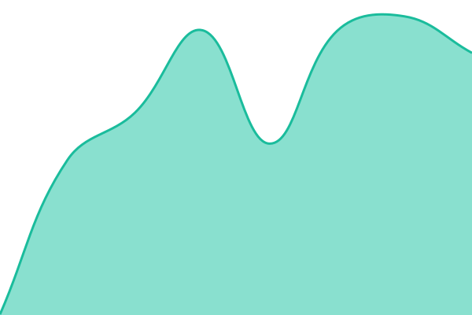
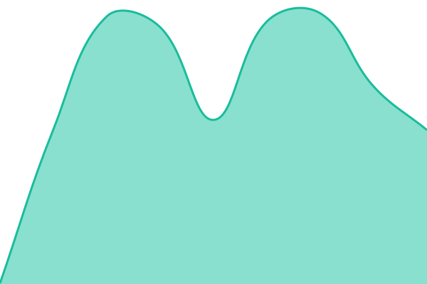

  

# RoboStux-Status

> Uptime monitor and status page for RoboStux's services, powered by [Upptime](https://github.com/upptime/upptime).

[📈 Live Status](https://status.robo.st): <!--live status--> **🟩 All systems operational**

With Upptime, this gets an unlimited and free uptime monitor and status page, powered entirely by this GitHub repository. [Issues](https://github.com/RoboStux/Status/issues) are used as incident reports, [Actions](https://github.com/RoboStux/Status/actions) as uptime monitors, and [Pages](https://status.robo.st) for the status page itself.

<!--start: status pages-->
<!-- This summary is generated by Upptime (https://github.com/upptime/upptime) -->
<!-- Do not edit this manually, your changes will be overwritten -->
<!-- prettier-ignore -->
| URL | Status | History | Response Time | Uptime |
| --- | ------ | ------- | ------------- | ------ |
|  [Website](https://robo.st) | 🟩 Up | [website.yml](https://github.com/RoboStux/Status/commits/HEAD/history/website.yml) | 

 550ms
     
 | 

<a href="https://status.robo.st/history/website">100.00%</a>
    

|  [Node 1](https://tiny1.servers.uk.stux.cloud/) | 🟩 Up | [node-1.yml](https://github.com/RoboStux/Status/commits/HEAD/history/node-1.yml) | 

 393ms
     
 | 

<a href="https://status.robo.st/history/node-1">100.00%</a>
    

|  [Bot](https://tiny1.servers.uk.stux.cloud/) | 🟩 Up | [bot.yml](https://github.com/RoboStux/Status/commits/HEAD/history/bot.yml) | 

 356ms
     
 | 

<a href="https://status.robo.st/history/bot">100.00%</a>
    

|  [CDN](https://global.media.robo.st/logo.png) | 🟩 Up | [cdn.yml](https://github.com/RoboStux/Status/commits/HEAD/history/cdn.yml) | 

 891ms
     
 | 

<a href="https://status.robo.st/history/cdn">100.00%</a>
    

<!--end: status pages-->

[**Visit our status website →**](https://status.robo.st)

## Author

 [StuxieDev](https://github.com/StuxieDev)

## License

- Code: distributed under the MIT License. See [`LICENSE` file](LICENSE) for more information.
- Data in the `./history` directory: [Open Database License](https://opendatacommons.org/licenses/odbl/1-0/)
